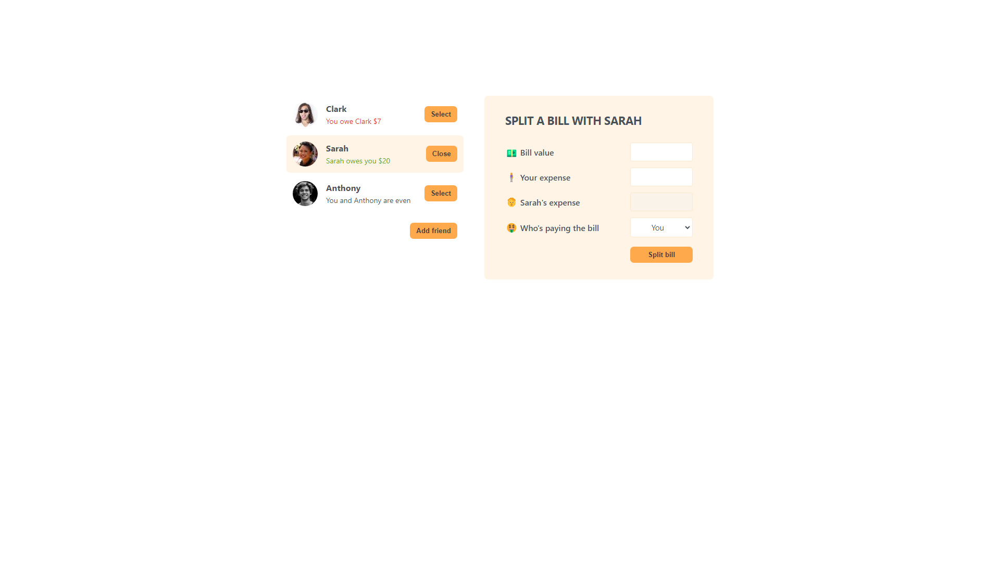

# eat-n-split

## Description

This is a simple app that allows you to split a bill between friends.

## Installation

To install the app, simply clone the repo and run `npm install` in the root directory.

## Usage

To use the app, run `npm start` in the root directory and navigate to `localhost:3000` in your browser.
